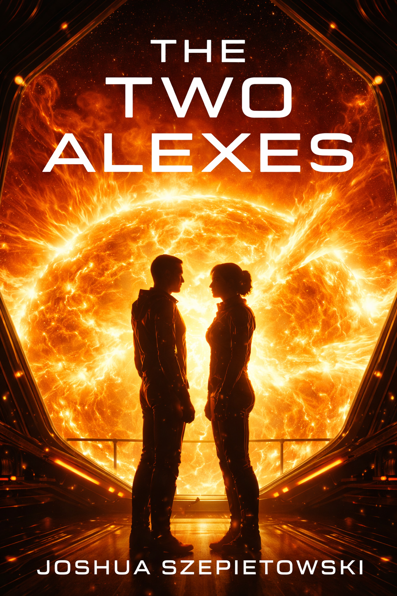

# The Two Alexes

A novella by Joshua Szepietowski

---

Two people share a name.

Two people share a platform suspended inside the corona of an unstable star.

Two people share meals, silences, fear, and the work of keeping each other alive.

They do not share the same heart.

---

**Alex** is a stellar physicist. She models flare probability and magnetic instability. She experiences the star as data first, sensation second. She is kind, patient, and emotionally complete. She does not withhold affection. She simply does not organize her life around it.

**Alex** is a pilot. He maintains orientation, vector alignment, and emergency response. He experiences the star as force first, abstraction second. He is attentive, emotionally open, and shaped by the need to be needed.

She can stand near the heat without wanting more.

He cannot.

---

*"The regret of my lie was insignificant next to the regret of my truth."*

---

This is not a story about rejection. No one is cruel. No one is lying.

This is a story about **asymmetry**—what happens when care exists without commitment, warmth exists without belonging, and proximity exists without reciprocity.

Two people can do nothing wrong and still break each other.

---

## Structure

**18 chapters across 5 acts**

- **Act I — The Aftermath**: The story opens after the truth has been spoken
- **Act II — Before the Truth**: The narrative moves backward through eighteen months
- **Act III — The Moment**: The confession, quiet and irreversible
- **Act IV — The Present**: Living inside what has been revealed
- **Act V — The Choice**: How he will remain

---

## Genre

Literary hard science fiction

The star is not a metaphor. It is physics. But it behaves exactly like the emotional core of the book—beautiful, dangerous, life-giving, and incapable of caring who it burns.

---

*"The cavity held. We held. That was enough."*

